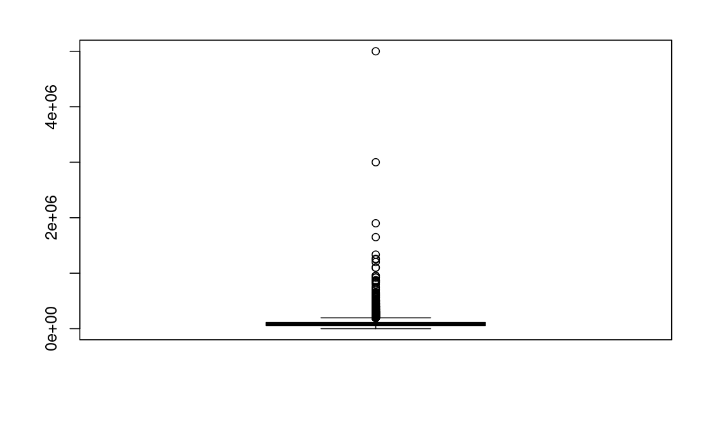
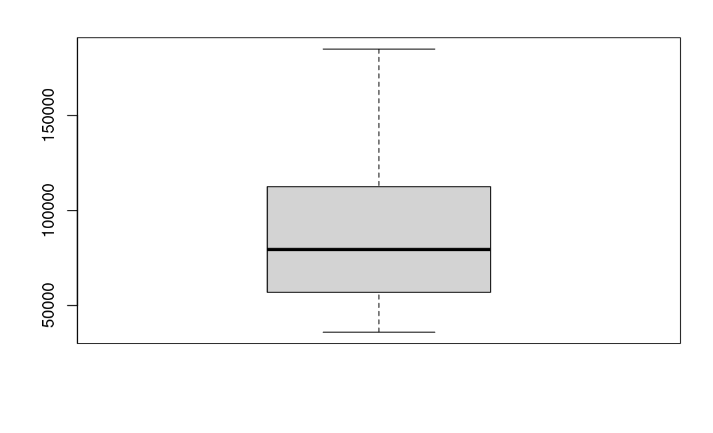

In preparing your data for machine learning you'll often come across features with values that are detached from the rest, we call them outliers.  Such values are a point of pain to most models as they are sensitive to outliers. Well, regression algorithms such as Robust regression, XGBoost Regressors and some more others are said to be 'robust' to outliers but I realized that may not be the case when we have quite a number of outliers. Real life data can be messy, and really messy for that matter. I came across such a dataset and while cleaning and preparing it for machine learning, I realized the target variable had quite a number of outliers which thing drove me into a bit of researching here and there on how to go about it.   

Often, in dealing with outliers,  two primary approaches are suggested.  

  * Impute the values with mean or median.   
  * Drop the records or variables with the outliers.   
  * Normalize your data (less often)
  
None of the above mentioned techniques sounded fit to address the outliers in the dataset I had. Now, here's a brief about the data.   

There's an ongoing [Salary Survey](https://www.askamanager.org/2021/04/how-much-money-do-you-make-4.html) done by askamanager.org.  
The main question asked in the form is how much money do you make plus a couple of more details such which industry, age, years of experience etc. The details a collected into a google sheet from which I obtained the data. 

Wanted to do some regression modelling to predict the salary given predictors such as years of experience, gender, level of education and other features. After some inspection that's when I realized the target variable (annual_salary) had so many outliers. I think now you have enough background on the case we're dealing with, right? cool !   

Enough of talking and let's now get our hands dirty !   

Let's get our tools 
Loading libraries 
```{r}
library(data.table)
```

And then the data  

I did an article on data cleaning for this data, check it here. As such, I'll just load the cleaned data so that we get straight to the point. 

```{r}
salarydata <- fread("./data/salary_data_cleaned.csv") 
```

Data inspection  

A histogram or boxplot not only help to show the distribution of the data but also the outliers. 
let's pick one of them and see how our target variable is distributed.  

```{r}
boxplot(salarydata$annual_salary)
```
   

Well well, hope you now see what I meant by so many outliers, huh? I mean, they're not two, three, four or even ten so that we impute them with the median value or mean if you like. Remember too that its salary we're dealing with. Its normal to have submissions with fellows earning way above normal and they can be quite many which is normal :)     

Now let's do some thinking on the options available.  

1. Imputing with median/mean.  
  - If we were talking about 3 or 4 values then this can be a compromise, not so with so many values as this will be misinforming the machine learning algorithm. Imagine a bunch of the submissions were guys from industry x, with over ten years of experience and whose earnings are way above normal, well I think it would good to have the machine learn that if someone is from industry x and they have over ten years of experience, you earn more. This may not be the case if we reduce the values to the median/mean.   
  
2. Dropping the records with outlying values. 
  - Sometimes outliers do occur dues to measurement or recording errors and dropping such can work, not so with our data seeing that its most likely not as a result of error. Hence, dropping them doesn't sound well for this case, also, I think this will lead to loss of information which might be important in the learnings of the machine.  
  
3. Normalization.  
  - My understanding of normalization is that it scales values into a range say 0 - 1, what that essentially means is that the extreme values will still lie in the extremeties of 0.9 whereas the other values doing the 0.000's. And this doesn't really address the outlier problem !   
  
And this is what brings us to the concept of winsorization.  
According to wikipedia, the term is defined as the transformation of statistics by limiting extreme values in the statistical data to reduce the effect of possibly spurious outliers, in other words we replace extreme values with less extreme values.   

This is how you go about it in R. Luckily there's a library for that which makes our work even simpler !    

```{r}
library(DescTools) # want to use the winsorize function  

winsorized.data <- salarydata[,.(winsorized.salary = Winsorize(annual_salary))]

boxplot(winsorized.data$winsorized.salary) 
```
    

Wow ! that was magic huh? anyway our data is looking much better, at least we can tell the graph is a boxplot :)   
So, essentially what the Winsorize function does is to replace the extreme values with the 95th quantile value of our data. Well, much as its a reduction, its way much better than replacing it with the median/mean. And, our machine will still get the learning that guys from industry x with over ten years of experience do tend to earn more much as the more isn't to the levels of actual data.    


References: 

https://cxl.com/blog/outliers/   

https://www.r-bloggers.com/2011/06/winsorization/     

https://en.wikipedia.org/wiki/Winsorizing    


