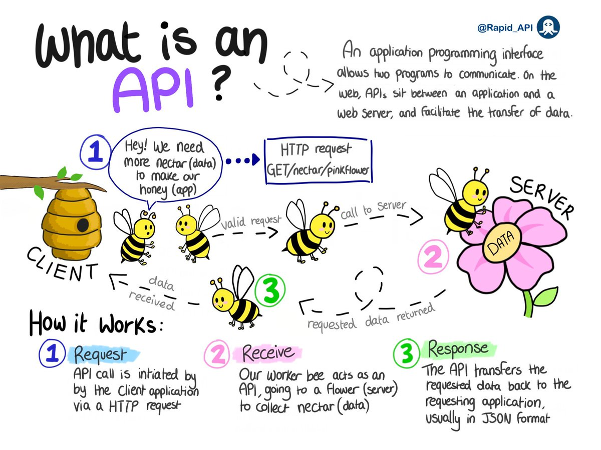

```{r setup, include=FALSE}
knitr::opts_chunk$set(echo = TRUE)
```

## API 
What's an API? 
Its simply an application that sits between a web server and an application to facilitate data transfer. The image below does some justice in explaining how it works. 



## FastAPI  
FastAPI is a modern, fast (high-performance), web framework for building APIs with Python 3.7+ based on standard Python type hints.   
FastAPI is very fast, as the name suggests, due to its out-of-the-box support of the async feature of Python 3.6+.   

### Installation  
```
$ pip install fastapi

```
###  Install an ASGI server (*for production*) : Uvicorn   

[Uvicorn](https://www.uvicorn.org/#why-asgi) is an ASGI web server implementation for python.    
[ASGI](https://asgi.readthedocs.io/en/latest/) (Asynchronous Server Gateway Interface) provides a standard interface between async-capable Python web servers, frameworks, and applications.  
In this case we'll have it linked to nginx webserver to forward requests to the FastAPI.   

```
$ pip install "uvicorn[standard]"  

```
Let's create a simple app and see how to run it using uvicorn. 
### Create a file myapp.py inside a directory 
Create a directory and name it as you wish, I'll call mine fastapiApp and place the .py file inside, mine is myapp.py.  
Below is a hello-world example of a fastAPI   

```
from fastapi import FastAPI

app = FastAPI()


@app.get("/")
async def root():
    return {"message": "Hello World"}


```
Now here's what's happening in the code above.  
  * The *from fastapi import FastAPI* : _Importing the required packages and functions._    
  * The *app = FastAPI()* : _We create an instance of the class FastAPI and assign it the name app. You can name it differently if you so wish_ 
  * *@app.get("/")*:  _Creates a *GET* path._ It tells FastAPI that the function right below is in charge of handling requests that go to _the path /_ using a _get_ operation.   
  This is possible using the *@* decorator.  
  * And now the part that starts with *async def root()* : _is the function that will be executed when someone visits the *GET* path of which, as in our case, the response to the user will be  *{"message": "Hello World"}*_. You're at liberty to define the function normally as  _(def root()...)_ instead of _(async def root()...)_.   
  
Note:  
  * The *get* in *@app.get("/")* is one of the HTTP methods/operations used to perform specific actions in response to a prompt from a client. 
  * Some of the methods are: 
    - POST: to create data 
    - GET: to read data  
    - PUT: to update data  
    - DELETE: to delete data   
 In our case we'll focus on POST and GET operations. GET to feedback to the client/user i.e telling them *{"Hello": "All is well"}* and POST for requests    
 
### Running the application    

Once you have your application set up as above, on the terminal navigate to a folder right above your project folder and run the application using the below commands.  

```
$ uvicorn myapp:app 

```
Here's what's happening   

  - *myapp* is the file myapp.py   
  - *app* is the FastAPI instance we created inside the myapp.py file. Remember the line _app=FastAPI()_. 
  
Once you run the command you'll have an output as below  

```
you@yourpc:~/Documents/myprojects/fastapiApp$ uvicorn myapp:app
INFO:     Started server process [195281]
INFO:     Waiting for application startup.
INFO:     Application startup complete.
INFO:     Uvicorn running on http://127.0.0.1:8000 (Press CTRL+C to quit)

```

Take the last line which has the url (http://127.0.0.1:8000) and paste it on your browser, you'll see the response that we defined under the get operation. 

```
{"message": "Hello World"}

```


### Basics of a FastAPI application  

#### Path parameters  

#### Query parameters    

#### Request body   


## Pydantic models  
This is a python library used to declare, validate and parse data. In the context of an API, data coming from a request.    

## example  


## Connecting your PC to the web.
## Localhost.run
Thanks to [localhost.run](https://localhost.run/docs/) we can create an HTTP tunnel to apps running locally in our PC's. An alternative approach could be ngrok but then the process is quite simple with localhost.run seeing that you don't need to sign up for an account and install a client locally, all you need is ssh client which is mostly built-in into major systems.     

To connect an internet domain to an application running locally on a given port say 8000 (like in this case, FastAPI),
open your terminal and enter the following commands.     
_Note: The only thing you need to change when connecting to a different app is the port number._   

```
$ ssh -R 80:localhost:8000 nokey@localhost.run

```

once you run the above command you'll see something similar to the output below: 

```
...
...

** your connection id is 9d7d4e04-ac0e-4350-9a43-35f56a4affe2, please mention it if you send me a message about an issue. **     

a6cb40db137498.lhrtunnel.link tunneled with tls termination, https://a6cb434db137498.lhrtunnel.link

```
The url you should use it the last bit of the output : https://a6cb434db137498.lhrtunnel.link.    

_Note: The url keeps on changing after about 20 or so minutes as such you might need to update it wherever you use it._        


References:  
1. https://fastapi.tiangolo.com/  
2. https://localhost.run/docs/   
3. https://www.uvicorn.org/#why-asgi  
4. https://asgi.readthedocs.io/en/latest/ 
5. https://www.educative.io/blog/python-fastapi-tutorial   

