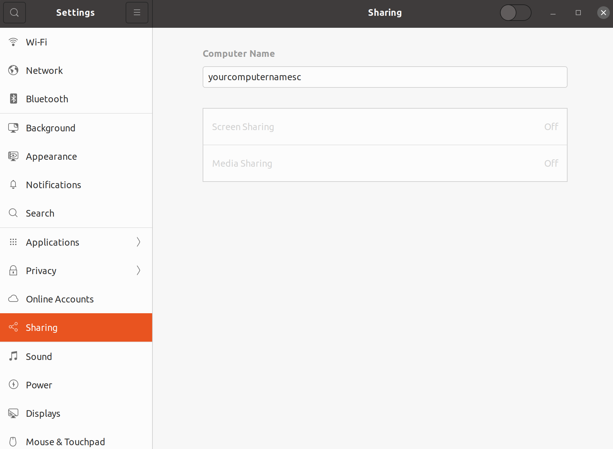
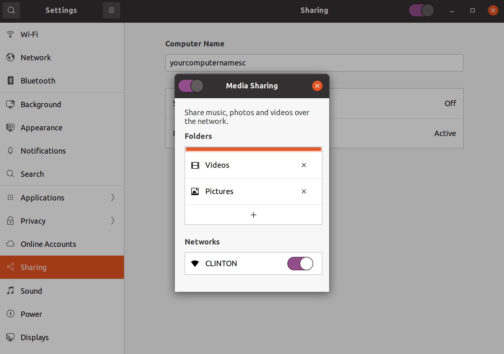
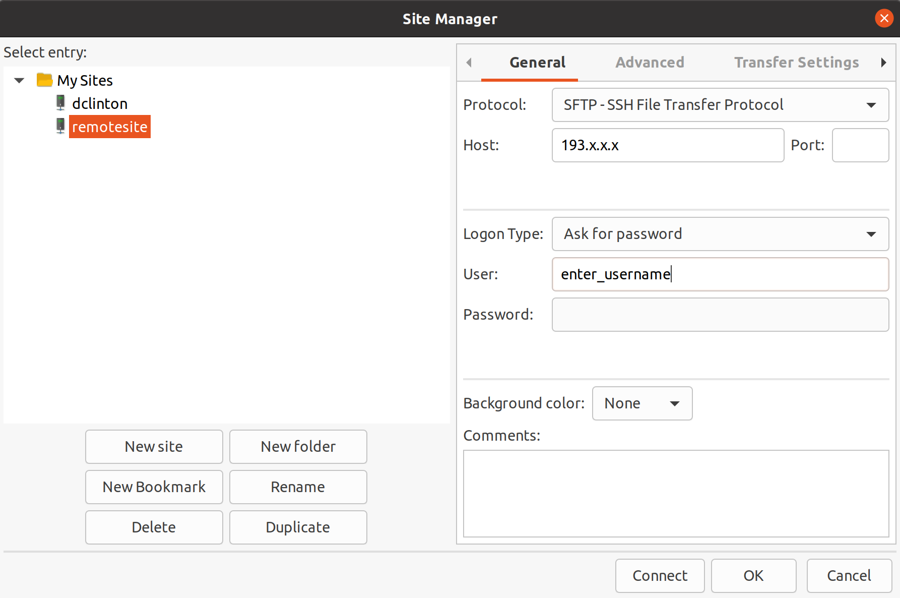

Ever been in a situation where you want to transfer large files/folder from one laptop to another, perhaps you're moving your folders to a new computer or from your computer to a server. Well, filezilla is one of the solutions I find easier and faster. 

Follow the steps below to perform your file transfer. 

1. Install filezilla on your laptop/computer. 

2. Ensure your destination allows file sharing. 
- On mac follow the guide below to check that option.  

      * Open system preferences.    
      * Select sharing.    
      * check the file transfer option.  
      * check the remote login option. 

- On linux use the following guide  

       * Select settings.  
       * Next choose sharing option.  
       
 
 
       * Enable the sharing button on the bar at the top.  
       * click on Media sharing then click the + option then select the folder with the files you want to transfer.  
       
      

3. Get the IP address of your destination laptop. 
* Open the terminal and type ifconfig
* The IP address in on en0/wlp4s0: the address is on inet.  

4. Open filezilla.  
* On the menu click on File then site manager. 

* On the left side of the panel that appears select new site then give it a name. 
* To the right side of the panel under general:   

    - select SFTP-SSH File Transfer Protocol   
    - enter the IP address on the Host section.  
    - For the Logn Type, you can choose to use password or normal. Select your preferred option.  
    - enter the user of your destination computer on the User section. 
    - hit the connect button and you will be prompted to enter the password for the remote server on a pop up that will appear.  
    
    
5. Once your connection is successful you can now drag and drop your files/folders from either your local site tp the remote site or vice versa.  

